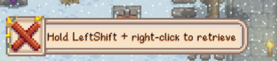

# Safe Crab Pots

Stop losing crab pots to misclicks. Right-click harvests (and auto-rebaits from hand),
and empty pots are only picked up with a deliberate modifier + right-click.

The vanilla pain, for reference: right-clicking an empty unbaited pot picks it up,
so every harvest run risks pocketing pots instead of checking them. Luremaster players
have it worst, since their pots never hold bait. Tools can't remove pots from water,
so click removal is the only path – this mod makes it deliberate.

## Contents

- [Behavior](#behavior)
- [Configuration](#configuration)
- [Requirements](#requirements)
- [Install](#install)
- [Compatibility](#compatibility)
- [Known limitations](#known-limitations)
- [Screenshots](#screenshots)
- [Author](#author)
- [License](#license)

## Behavior

| Situation | Right-click |
|---|---|
| Catch ready | harvest (+ auto-rebait if holding bait) |
| Holding bait, no catch | bait the pot (vanilla) |
| Empty pot | nothing, or modifier + right-click retrieves (`Modifier`) |

Pickup priority is always harvest > bait > retrieve: a pot with a catch is never picked up.

## Configuration

GMCM page (or `config.json` next to the DLL):

| Option | Values | Default |
|---|---|---|
| `RightClickPickup` | `Off` / `Modifier` / `Always` | `Modifier` |
| `RetrieveModifier` | keybind | `LeftShift` |
| `AutoRebait` | on / off | on |

- `Off`: right-click never picks pots up.
- `Modifier`: empty pots are retrieved only with modifier + right-click (a hint is shown without the modifier).
- `Always`: vanilla right-click behavior. Useful for gamepads (no modifier key) or diagnosing conflicts.

## Requirements

- Stardew Valley 1.6
- [SMAPI](https://smapi.io) 4.x
- [Generic Mod Config Menu](https://www.nexusmods.com/stardewvalley/mods/5098) (optional, for the in-game options page)

## Install

1. Install SMAPI.
2. Unzip the `SafeCrabPots` folder into `Stardew Valley/Mods`.
3. Run the game via SMAPI.

No save changes; safe to add or remove at any time.

## Compatibility

- Multiplayer: install for every player interacting with pots.
- `Better Crab Pot` (catch math): compatible, it touches catch generation (`DayUpdate`), this mod touches clicks.
- `Custom Crab Pot` (full overhaul with auto-harvest/auto-bait): pick one, both rewrite click behavior.
- Patches are defensive: they only act when the pot is in the expected vanilla state, otherwise vanilla runs.

## Known limitations

- Gamepad: assign any controller button (e.g. `LeftTrigger`) to `Retrieve modifier` in GMCM, or write `"RetrieveModifier": "LeftTrigger"` in `config.json`. Keybinds are device-agnostic, no extra setup needed. Untested on real hardware, feedback welcome.

## Screenshots

Retrieve hint shown when right-clicking an empty pot without the modifier:

## Author

Markentyy – [GitHub](https://github.com/Markentyy).

## License

MIT – see [LICENSE](LICENSE).
